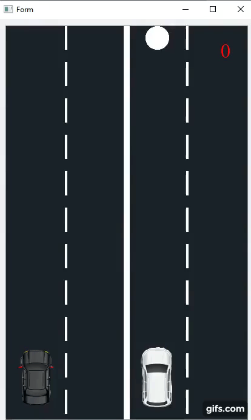

## Two_Cars
This game is based off the "2 Cars" android game created by "Ketchapp". I decided to recreate it as a Desktop application as my Udacity C++ nanoDdegree CApstone Project. This is what the game looks like when launched.

The idea of the game is to avoid the Squares and not miss a single Circle.

##How to play the game:
1.  Download the "executable" folder and launch the "Two_Cars.exe". 
Note: The folder contains all the dll's that is needed to run the game.

##How to build the game from scratch:
There are two ways to do this 
1. Using the Qt Creator.
a. Download the Qt IDE from [Qt official download page](https://www.qt.io/download)
b. Open the prject in the IDE "Two_Cars.pro"
c. Click on build.

2. Using qmake
a. Run qmake on "the source_code" folder to create a platform_specific build folder like the build folder in this repo. 
   qmake would aslo create MakeFiles for you run `make` yourself
   
##the file ,class structure and the expected behavior or output of the program.
Each object has its class.
The car is in the `car.cpp` and `car.h`files.
  This the centre of the game, you move both cars to avoid Sqaures
The Circle is in the `circle.cpp` and `circle.h` files.
  This item is not to be missed, you are to touch all circle
The Squre is in the `square.cpp` and `square.h`files
  If the car collides with thid item, the game comes to an end
The Score counter is in the `scoreboard.cpp` and `scoreboard.h`files
  This counts the number of circles that have been touched before the game ends;

The landingpage contains the first Page you see when you start the game. It has three buttons
1. START - This starts the game
2. HOW TO PLAY - This contains instruction on how to play
3. ABOUT THE GAME - This gives iinformation about the game at its current state

##The Rubric Points Passed
1.A variety of control structures are used in the project.
I used diffent Data Structure for the diffent Items in the game
2.The project code is clearly organized into functions.
Each item has a function to do a certain task, like move, increase score.
3.The project accepts input from a user as part of the necessary operation of the program.
The user uses the Left and Right arrow keys to control the cars
4.The project code is organized into classes with class attributes to hold the data, and class methods to perform tasks.
Each Class has functions of their own
5.All class data members are explicitly specified as public, protected, or private.
Every class has private and public member functions. An example is the "MyScene" Class which has public,private and a protected member.
6.All class members that are set to argument values are initialized through member initialization lists.
An example is the `scoreboard.cpp` where the constructor initailizes the `score` and its parent.
7.One function is overloaded with different signatures for the same function name.
The Circle and Square class has two constructors that take diffent types of arguments.
8.One function is declared with a template that allows it to accept a generic parameter.
The Singleton class uses a temlate such that it works with Circles and Squares
9.For all classes, if any one of the copy constructor, copy assignment operator, move constructor, move assignment operator, and destructor are defined, then all of these functions are defined.
The singleton class implements the rule of 5.
9.At least one class that uses unmanaged dynamically allocated memory, along with any class that otherwise needs to modify state upon the termination of an object, uses a destructor.
For every call to `new` there is a corresponding call to `delete` in the destructors

   

